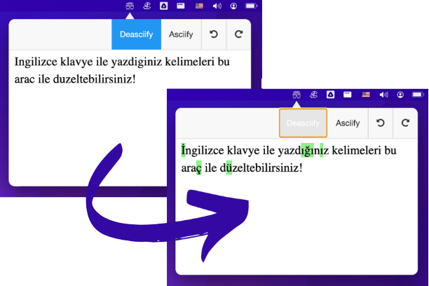

  
  

    <h3>
      <b>
        Turkish Deasciifier
      </b>
    </h3>
  

  

    <b>
      Tray application for Turkish Deasciifier
    </b>
  

   
  
   
   
  

  

### **Features**

**Deasciifier:** Adapt your texts to Turkish with one click.

**Asciifier:** Also, set your Turkish texts to ASCII with one click.

**Offline:** It works offline, no internet required.

**Tray Application:** It runs as a tray application, not bothering you with dummy screens.

**Multiplatform:** Every platform are supported; macOS, Windows, and even Linux.

**Auto Update:** It comes with an updater, you can easily update the app.

## **Authors**

This project exists thanks to all the people who contribute.

## **License**

This project is licensed under the [MIT License](https://opensource.org/licenses/MIT) - see the [`LICENSE`](LICENSE) file for details.
